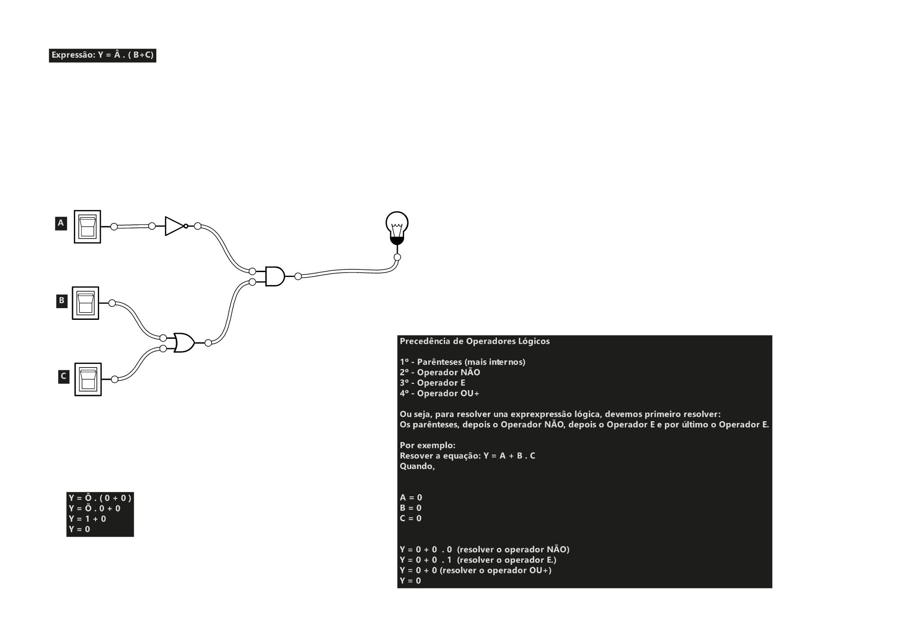

# Hello world :)

# Projeto de Fundamentos da Computação: Circuito Lógico

### 





<ol dir="auto">
<li>
<p dir="auto"><strong>Nesse projeto, criei um circuito eletrônico para reprsentar os operados lógicos (NÃO, E e OU+)
utilizando as portas lógicas e os operadores lógicos (NOT, AND e OR)
Para termos a expressão operando plenamente, teremos que executar o circuito lógico utilizando:</strong></p>
<p dir="auto">Você pode incorporar uma imagem diretamente no README usando a seguinte sintaxe de Markdown:</p>
<div class="highlight highlight-text-md notranslate position-relative overflow-auto" dir="auto"><pre class="notranslate"><span class="pl-s">a) a precedência de operadores, esta nos diz que, devemos resolver primeiro os parêntes.
 Logo, quando temos a expressão <span class="pl-s">]</span><span class="pl-s">(</span><span class="pl-corl"> 
  ` Y = Â.(B+C)`

```js
 Y = Â.(B+C)```
</span><span class="pl-s">)</span></pre><div class="zeroclipboard-container position-absolute right-0 top-0">
    <clipboard-copy aria-label="Copy" class="ClipboardButton btn js-clipboard-copy m-2 p-0 tooltipped-no-delay" data-copy-feedback="Copied!" data-tooltip-direction="w" value="" tabindex="0" role="button" style="display: inherit;">
      <svg aria-hidden="true" height="16" viewBox="0 0 16 16" version="1.1" width="16" data-view-component="true" class="octicon octicon-copy js-clipboard-copy-icon m-2">
    <path d="M0 6.75C0 5.784.784 5 1.75 5h1.5a.75.75 0 0 1 0 1.5h-1.5a.25.25 0 0 0-.25.25v7.5c0 .138.112.25.25.25h7.5a.25.25 0 0 0 .25-.25v-1.5a.75.75 0 0 1 1.5 0v1.5A1.75 1.75 0 0 1 9.25 16h-7.5A1.75 1.75 0 0 1 0 14.25Z"></path><path d="M5 1.75C5 .784 5.784 0 6.75 0h7.5C15.216 0 16 .784 16 1.75v7.5A1.75 1.75 0 0 1 14.25 11h-7.5A1.75 1.75 0 0 1 5 9.25Zm1.75-.25a.25.25 0 0 0-.25.25v7.5c0 .138.112.25.25.25h7.5a.25.25 0 0 0 .25-.25v-7.5a.25.25 0 0 0-.25-.25Z"></path>
</svg>
      <svg aria-hidden="true" height="16" viewBox="0 0 16 16" version="1.1" width="16" data-view-component="true" class="octicon octicon-check js-clipboard-check-icon color-fg-success d-none m-2">
    <path d="M13.78 4.22a.75.75 0 0 1 0 1.06l-7.25 7.25a.75.75 0 0 1-1.06 0L2.22 9.28a.751.751 0 0 1 .018-1.042.751.751 0 0 1 1.042-.018L6 10.94l6.72-6.72a.75.75 0 0 1 1.06 0Z"></path>
</svg>
    </clipboard-copy>
  </div></div>
<ul dir="auto">
<li><code class="notranslate">Texto Alternativo</code>: Isso é o que será exibido se a imagem não puder ser carregada ou para fins de acessibilidade. É uma boa prática descrever brevemente a imagem aqui.</li>
<li><code class="notranslate">URL_da_Imagem</code>: Substitua isso pela URL da imagem que deseja incorporar. A imagem deve estar hospedada online, como no próprio repositório, em um serviço de hospedagem de imagens, ou em qualquer outro local acessível pela internet.</li>
</ul>
<p dir="auto">Por exemplo:</p>
<div class="highlight highlight-text-md notranslate position-relative overflow-auto" dir="auto"><pre class="notranslate"><span class="pl-s">![</span>Logo da Minha Empresa<span class="pl-s">]</span><span class="pl-s">(</span><span class="pl-corl">https://exemplo.com/logo.png</span><span class="pl-s">)</span></pre><div class="zeroclipboard-container position-absolute right-0 top-0">
    <clipboard-copy aria-label="Copy" class="ClipboardButton btn js-clipboard-copy m-2 p-0 tooltipped-no-delay" data-copy-feedback="Copied!" data-tooltip-direction="w" value="" tabindex="0" role="button">
      <svg aria-hidden="true" height="16" viewBox="0 0 16 16" version="1.1" width="16" data-view-component="true" class="octicon octicon-copy js-clipboard-copy-icon m-2">
    <path d="M0 6.75C0 5.784.784 5 1.75 5h1.5a.75.75 0 0 1 0 1.5h-1.5a.25.25 0 0 0-.25.25v7.5c0 .138.112.25.25.25h7.5a.25.25 0 0 0 .25-.25v-1.5a.75.75 0 0 1 1.5 0v1.5A1.75 1.75 0 0 1 9.25 16h-7.5A1.75 1.75 0 0 1 0 14.25Z"></path><path d="M5 1.75C5 .784 5.784 0 6.75 0h7.5C15.216 0 16 .784 16 1.75v7.5A1.75 1.75 0 0 1 14.25 11h-7.5A1.75 1.75 0 0 1 5 9.25Zm1.75-.25a.25.25 0 0 0-.25.25v7.5c0 .138.112.25.25.25h7.5a.25.25 0 0 0 .25-.25v-7.5a.25.25 0 0 0-.25-.25Z"></path>
</svg>
      <svg aria-hidden="true" height="16" viewBox="0 0 16 16" version="1.1" width="16" data-view-component="true" class="octicon octicon-check js-clipboard-check-icon color-fg-success d-none m-2">
    <path d="M13.78 4.22a.75.75 0 0 1 0 1.06l-7.25 7.25a.75.75 0 0 1-1.06 0L2.22 9.28a.751.751 0 0 1 .018-1.042.751.751 0 0 1 1.042-.018L6 10.94l6.72-6.72a.75.75 0 0 1 1.06 0Z"></path>
</svg>
    </clipboard-copy>
  </div></div>
</li>
<li>

<p dir="auto"><strong>Usar a tag HTML <code class="notranslate">&lt;img&gt;</code>:</strong></p>
<p dir="auto">Você também pode usar a tag HTML <code class="notranslate">&lt;img&gt;</code> para inserir uma imagem diretamente no README. Isso é útil quando você precisa de mais controle sobre o tamanho ou outros atributos da imagem. O exemplo a seguir demonstra como fazer isso:</p>
<div class="highlight highlight-text-html-basic notranslate position-relative overflow-auto" dir="auto"><pre class="notranslate"><span class="pl-kos">&lt;</span><span class="pl-ent">img</span> <span class="pl-c1">src</span>="<span class="pl-s">URL_da_Imagem</span>" <span class="pl-c1">alt</span>="<span class="pl-s">Texto Alternativo</span>"<span class="pl-kos">&gt;</span></pre><div class="zeroclipboard-container position-absolute right-0 top-0">
    <clipboard-copy aria-label="Copy" class="ClipboardButton btn js-clipboard-copy m-2 p-0 tooltipped-no-delay" data-copy-feedback="Copied!" data-tooltip-direction="w" value="" tabindex="0" role="button">
      <svg aria-hidden="true" height="16" viewBox="0 0 16 16" version="1.1" width="16" data-view-component="true" class="octicon octicon-copy js-clipboard-copy-icon m-2">
    <path d="M0 6.75C0 5.784.784 5 1.75 5h1.5a.75.75 0 0 1 0 1.5h-1.5a.25.25 0 0 0-.25.25v7.5c0 .138.112.25.25.25h7.5a.25.25 0 0 0 .25-.25v-1.5a.75.75 0 0 1 1.5 0v1.5A1.75 1.75 0 0 1 9.25 16h-7.5A1.75 1.75 0 0 1 0 14.25Z"></path><path d="M5 1.75C5 .784 5.784 0 6.75 0h7.5C15.216 0 16 .784 16 1.75v7.5A1.75 1.75 0 0 1 14.25 11h-7.5A1.75 1.75 0 0 1 5 9.25Zm1.75-.25a.25.25 0 0 0-.25.25v7.5c0 .138.112.25.25.25h7.5a.25.25 0 0 0 .25-.25v-7.5a.25.25 0 0 0-.25-.25Z"></path>
</svg>
      <svg aria-hidden="true" height="16" viewBox="0 0 16 16" version="1.1" width="16" data-view-component="true" class="octicon octicon-check js-clipboard-check-icon color-fg-success d-none m-2">
    <path d="M13.78 4.22a.75.75 0 0 1 0 1.06l-7.25 7.25a.75.75 0 0 1-1.06 0L2.22 9.28a.751.751 0 0 1 .018-1.042.751.751 0 0 1 1.042-.018L6 10.94l6.72-6.72a.75.75 0 0 1 1.06 0Z"></path>
</svg>
    </clipboard-copy>
  </div></div>
<ul dir="auto">
<li><code class="notranslate">src</code>: Substitua isso pela URL da imagem.</li>
<li><code class="notranslate">alt</code>: Como na sintaxe Markdown, isso é o texto alternativo que será exibido se a imagem não puder ser carregada ou para fins de acessibilidade.</li>
</ul>
<p dir="auto">Por exemplo:</p>
<div class="highlight highlight-text-html-basic notranslate position-relative overflow-auto" dir="auto"><pre class="notranslate"><span class="pl-kos">&lt;</span><span class="pl-ent">img</span> <span class="pl-c1">src</span>="<span class="pl-s">https://exemplo.com/logo.png</span>" <span class="pl-c1">alt</span>="<span class="pl-s">Logo da Minha Empresa</span>"<span class="pl-kos">&gt;</span></pre><div class="zeroclipboard-container position-absolute right-0 top-0">
    <clipboard-copy aria-label="Copy" class="ClipboardButton btn js-clipboard-copy m-2 p-0 tooltipped-no-delay" data-copy-feedback="Copied!" data-tooltip-direction="w" value="" tabindex="0" role="button">
      <svg aria-hidden="true" height="16" viewBox="0 0 16 16" version="1.1" width="16" data-view-component="true" class="octicon octicon-copy js-clipboard-copy-icon m-2">
    <path d="M0 6.75C0 5.784.784 5 1.75 5h1.5a.75.75 0 0 1 0 1.5h-1.5a.25.25 0 0 0-.25.25v7.5c0 .138.112.25.25.25h7.5a.25.25 0 0 0 .25-.25v-1.5a.75.75 0 0 1 1.5 0v1.5A1.75 1.75 0 0 1 9.25 16h-7.5A1.75 1.75 0 0 1 0 14.25Z"></path><path d="M5 1.75C5 .784 5.784 0 6.75 0h7.5C15.216 0 16 .784 16 1.75v7.5A1.75 1.75 0 0 1 14.25 11h-7.5A1.75 1.75 0 0 1 5 9.25Zm1.75-.25a.25.25 0 0 0-.25.25v7.5c0 .138.112.25.25.25h7.5a.25.25 0 0 0 .25-.25v-7.5a.25.25 0 0 0-.25-.25Z"></path>
</svg>
      <svg aria-hidden="true" height="16" viewBox="0 0 16 16" version="1.1" width="16" data-view-component="true" class="octicon octicon-check js-clipboard-check-icon color-fg-success d-none m-2">
    <path d="M13.78 4.22a.75.75 0 0 1 0 1.06l-7.25 7.25a.75.75 0 0 1-1.06 0L2.22 9.28a.751.751 0 0 1 .018-1.042.751.751 0 0 1 1.042-.018L6 10.94l6.72-6.72a.75.75 0 0 1 1.06 0Z"></path>
</svg>
    </clipboard-copy>
  </div></div>
</li>
</ol>


<ol dir="auto">
<li>
<p dir="auto"><strong>Incorporar a imagem diretamente no README:</strong></p>
<p dir="auto">Você pode incorporar uma imagem diretamente no README usando a seguinte sintaxe de Markdown:</p>
<div class="highlight highlight-text-md notranslate position-relative overflow-auto" dir="auto"><pre class="notranslate"><span class="pl-s">![</span>Texto Alternativo<span class="pl-s">]</span><span class="pl-s">(</span><span class="pl-corl">URL_da_Imagem</span><span class="pl-s">)</span></pre><div class="zeroclipboard-container position-absolute right-0 top-0">
    <clipboard-copy aria-label="Copy" class="ClipboardButton btn js-clipboard-copy m-2 p-0 tooltipped-no-delay" data-copy-feedback="Copied!" data-tooltip-direction="w" value="" tabindex="0" role="button" style="display: inherit;">
      <svg aria-hidden="true" height="16" viewBox="0 0 16 16" version="1.1" width="16" data-view-component="true" class="octicon octicon-copy js-clipboard-copy-icon m-2">
    <path d="M0 6.75C0 5.784.784 5 1.75 5h1.5a.75.75 0 0 1 0 1.5h-1.5a.25.25 0 0 0-.25.25v7.5c0 .138.112.25.25.25h7.5a.25.25 0 0 0 .25-.25v-1.5a.75.75 0 0 1 1.5 0v1.5A1.75 1.75 0 0 1 9.25 16h-7.5A1.75 1.75 0 0 1 0 14.25Z"></path><path d="M5 1.75C5 .784 5.784 0 6.75 0h7.5C15.216 0 16 .784 16 1.75v7.5A1.75 1.75 0 0 1 14.25 11h-7.5A1.75 1.75 0 0 1 5 9.25Zm1.75-.25a.25.25 0 0 0-.25.25v7.5c0 .138.112.25.25.25h7.5a.25.25 0 0 0 .25-.25v-7.5a.25.25 0 0 0-.25-.25Z"></path>
</svg>
      <svg aria-hidden="true" height="16" viewBox="0 0 16 16" version="1.1" width="16" data-view-component="true" class="octicon octicon-check js-clipboard-check-icon color-fg-success d-none m-2">
    <path d="M13.78 4.22a.75.75 0 0 1 0 1.06l-7.25 7.25a.75.75 0 0 1-1.06 0L2.22 9.28a.751.751 0 0 1 .018-1.042.751.751 0 0 1 1.042-.018L6 10.94l6.72-6.72a.75.75 0 0 1 1.06 0Z"></path>
</svg>
    </clipboard-copy>
  </div></div>
<ul dir="auto">
<li><code class="notranslate">Texto Alternativo</code>: Isso é o que será exibido se a imagem não puder ser carregada ou para fins de acessibilidade. É uma boa prática descrever brevemente a imagem aqui.</li>
<li><code class="notranslate">URL_da_Imagem</code>: Substitua isso pela URL da imagem que deseja incorporar. A imagem deve estar hospedada online, como no próprio repositório, em um serviço de hospedagem de imagens, ou em qualquer outro local acessível pela internet.</li>
</ul>
<p dir="auto">Por exemplo:</p>
<div class="highlight highlight-text-md notranslate position-relative overflow-auto" dir="auto"><pre class="notranslate"><span class="pl-s">![</span>Logo da Minha Empresa<span class="pl-s">]</span><span class="pl-s">(</span><span class="pl-corl">https://exemplo.com/logo.png</span><span class="pl-s">)</span></pre><div class="zeroclipboard-container position-absolute right-0 top-0">
    <clipboard-copy aria-label="Copy" class="ClipboardButton btn js-clipboard-copy m-2 p-0 tooltipped-no-delay" data-copy-feedback="Copied!" data-tooltip-direction="w" value="" tabindex="0" role="button">
      <svg aria-hidden="true" height="16" viewBox="0 0 16 16" version="1.1" width="16" data-view-component="true" class="octicon octicon-copy js-clipboard-copy-icon m-2">
    <path d="M0 6.75C0 5.784.784 5 1.75 5h1.5a.75.75 0 0 1 0 1.5h-1.5a.25.25 0 0 0-.25.25v7.5c0 .138.112.25.25.25h7.5a.25.25 0 0 0 .25-.25v-1.5a.75.75 0 0 1 1.5 0v1.5A1.75 1.75 0 0 1 9.25 16h-7.5A1.75 1.75 0 0 1 0 14.25Z"></path><path d="M5 1.75C5 .784 5.784 0 6.75 0h7.5C15.216 0 16 .784 16 1.75v7.5A1.75 1.75 0 0 1 14.25 11h-7.5A1.75 1.75 0 0 1 5 9.25Zm1.75-.25a.25.25 0 0 0-.25.25v7.5c0 .138.112.25.25.25h7.5a.25.25 0 0 0 .25-.25v-7.5a.25.25 0 0 0-.25-.25Z"></path>
</svg>
      <svg aria-hidden="true" height="16" viewBox="0 0 16 16" version="1.1" width="16" data-view-component="true" class="octicon octicon-check js-clipboard-check-icon color-fg-success d-none m-2">
    <path d="M13.78 4.22a.75.75 0 0 1 0 1.06l-7.25 7.25a.75.75 0 0 1-1.06 0L2.22 9.28a.751.751 0 0 1 .018-1.042.751.751 0 0 1 1.042-.018L6 10.94l6.72-6.72a.75.75 0 0 1 1.06 0Z"></path>
</svg>
    </clipboard-copy>
  </div></div>
</li>
<li>
<p dir="auto"><strong>Usar a tag HTML <code class="notranslate">&lt;img&gt;</code>:</strong></p>
<p dir="auto">Você também pode usar a tag HTML <code class="notranslate">&lt;img&gt;</code> para inserir uma imagem diretamente no README. Isso é útil quando você precisa de mais controle sobre o tamanho ou outros atributos da imagem. O exemplo a seguir demonstra como fazer isso:</p>
<div class="highlight highlight-text-html-basic notranslate position-relative overflow-auto" dir="auto"><pre class="notranslate"><span class="pl-kos">&lt;</span><span class="pl-ent">img</span> <span class="pl-c1">src</span>="<span class="pl-s">URL_da_Imagem</span>" <span class="pl-c1">alt</span>="<span class="pl-s">Texto Alternativo</span>"<span class="pl-kos">&gt;</span></pre><div class="zeroclipboard-container position-absolute right-0 top-0">
    <clipboard-copy aria-label="Copy" class="ClipboardButton btn js-clipboard-copy m-2 p-0 tooltipped-no-delay" data-copy-feedback="Copied!" data-tooltip-direction="w" value="" tabindex="0" role="button">
      <svg aria-hidden="true" height="16" viewBox="0 0 16 16" version="1.1" width="16" data-view-component="true" class="octicon octicon-copy js-clipboard-copy-icon m-2">
    <path d="M0 6.75C0 5.784.784 5 1.75 5h1.5a.75.75 0 0 1 0 1.5h-1.5a.25.25 0 0 0-.25.25v7.5c0 .138.112.25.25.25h7.5a.25.25 0 0 0 .25-.25v-1.5a.75.75 0 0 1 1.5 0v1.5A1.75 1.75 0 0 1 9.25 16h-7.5A1.75 1.75 0 0 1 0 14.25Z"></path><path d="M5 1.75C5 .784 5.784 0 6.75 0h7.5C15.216 0 16 .784 16 1.75v7.5A1.75 1.75 0 0 1 14.25 11h-7.5A1.75 1.75 0 0 1 5 9.25Zm1.75-.25a.25.25 0 0 0-.25.25v7.5c0 .138.112.25.25.25h7.5a.25.25 0 0 0 .25-.25v-7.5a.25.25 0 0 0-.25-.25Z"></path>
</svg>
      <svg aria-hidden="true" height="16" viewBox="0 0 16 16" version="1.1" width="16" data-view-component="true" class="octicon octicon-check js-clipboard-check-icon color-fg-success d-none m-2">
    <path d="M13.78 4.22a.75.75 0 0 1 0 1.06l-7.25 7.25a.75.75 0 0 1-1.06 0L2.22 9.28a.751.751 0 0 1 .018-1.042.751.751 0 0 1 1.042-.018L6 10.94l6.72-6.72a.75.75 0 0 1 1.06 0Z"></path>
</svg>
    </clipboard-copy>
  </div></div>
<ul dir="auto">
<li><code class="notranslate">src</code>: Substitua isso pela URL da imagem.</li>
<li><code class="notranslate">alt</code>: Como na sintaxe Markdown, isso é o texto alternativo que será exibido se a imagem não puder ser carregada ou para fins de acessibilidade.</li>
</ul>
<p dir="auto">Por exemplo:</p>
<div class="highlight highlight-text-html-basic notranslate position-relative overflow-auto" dir="auto"><pre class="notranslate"><span class="pl-kos">&lt;</span><span class="pl-ent">img</span> <span class="pl-c1">src</span>="<span class="pl-s">https://exemplo.com/logo.png</span>" <span class="pl-c1">alt</span>="<span class="pl-s">Logo da Minha Empresa</span>"<span class="pl-kos">&gt;</span></pre><div class="zeroclipboard-container position-absolute right-0 top-0">
    <clipboard-copy aria-label="Copy" class="ClipboardButton btn js-clipboard-copy m-2 p-0 tooltipped-no-delay" data-copy-feedback="Copied!" data-tooltip-direction="w" value="" tabindex="0" role="button">
      <svg aria-hidden="true" height="16" viewBox="0 0 16 16" version="1.1" width="16" data-view-component="true" class="octicon octicon-copy js-clipboard-copy-icon m-2">
    <path d="M0 6.75C0 5.784.784 5 1.75 5h1.5a.75.75 0 0 1 0 1.5h-1.5a.25.25 0 0 0-.25.25v7.5c0 .138.112.25.25.25h7.5a.25.25 0 0 0 .25-.25v-1.5a.75.75 0 0 1 1.5 0v1.5A1.75 1.75 0 0 1 9.25 16h-7.5A1.75 1.75 0 0 1 0 14.25Z"></path><path d="M5 1.75C5 .784 5.784 0 6.75 0h7.5C15.216 0 16 .784 16 1.75v7.5A1.75 1.75 0 0 1 14.25 11h-7.5A1.75 1.75 0 0 1 5 9.25Zm1.75-.25a.25.25 0 0 0-.25.25v7.5c0 .138.112.25.25.25h7.5a.25.25 0 0 0 .25-.25v-7.5a.25.25 0 0 0-.25-.25Z"></path>
</svg>
      <svg aria-hidden="true" height="16" viewBox="0 0 16 16" version="1.1" width="16" data-view-component="true" class="octicon octicon-check js-clipboard-check-icon color-fg-success d-none m-2">
    <path d="M13.78 4.22a.75.75 0 0 1 0 1.06l-7.25 7.25a.75.75 0 0 1-1.06 0L2.22 9.28a.751.751 0 0 1 .018-1.042.751.751 0 0 1 1.042-.018L6 10.94l6.72-6.72a.75.75 0 0 1 1.06 0Z"></path>
</svg>
    </clipboard-copy>
  </div></div>
</li>
</ol>


